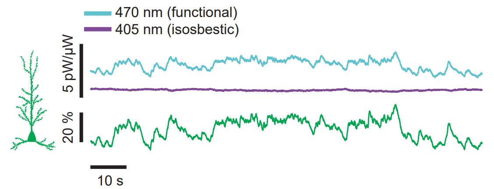

# Fused Fiber Photometry

The code allows reproduction of the analysis of data presented in the manuscript "A flexible and versatile system for multi-color fiber photometry and optogenetic manipulation", Cell Method Reports, 2023, by Formozov, Dieter, and Wiegert. 

The corresponding data is deposited at https://gin.g-node.org/SW_lab/FusedFiberPhotometry

The path to the data have to be adjusted in the *data_location* script. 

Dependencies (including additional MATLAB toolboxes to be installed):
- *FFP_code* folder (added to the MATLAB path automatically) contains essential functions used in the scripts (*import_ppd*, *re_sample* and others).
- Curve Fitting Toolbox (*smooth*)
- Statistics and Machine Learning Toolbox (*lsline*, *ttest2*)  

The code was tested on MATLAB version 2022b.

## Appendix: a comment on the procedure for coupler ports assignment

The 90:10 couplers have transmission characteristics that are particularly suitable for FFP implementation. Each coupler has four connectors: red and white (we define it as *whiteR*) on one side, and blue and white (*whiteB*) on the other. Therefore, there are four possibilities for how the "light source", "brain," and "detector" ports can be assigned.  

The table below suggests the procedure for the measurement of transmission and optimization through the proper assignment of ports to the fiber connectors for three exemplary couplers. The best configuration for each coupler is marked in bold. The priority should be given to the "brain"-the "detector" ports transmission first as it is typically the most critical parameter. Two out of three compilers demonstrate particularly suitable characteristics. All measurements are performed at 600 nm to match a typical factory procedure.

|   |   "light source"-"brain" ports | power, uW | "brain"-"detector" ports | power, uW |
| - | ------------ | --------- | ------------- | --------- |
| 1 | red - whiteB | 165       | whiteB-whiteR | 570       |
| 2 | **whiteR-blue**  | **220**       | **blue-red**      | **1025**      |
| 3 | blue-whiteR  | 230       | whiteR-whiteB | 615      |
| 4 | whiteB-red   | 127       | red-blue      | 970       |
|   |              |           |               |           |
|   |              |           |               |           |
|   |              |           |               |           |
|   |              |           |               |           |
|   |              |           |               |           |
| 1 | red - whiteB | 88        | whiteB-whiteR | 760       |
| 2 | **whiteR-blu**e  | **170**   | **blue-red**  | **770**  |
| 3 | blue-whiteR  | 169       | whiteR-whiteB | 760       |
| 4 | whiteB-red   | 87        | red-blue      | 795       |
|   |              |           |               |           |
|   |              |           |               |           |
|   |              |           |               |           |
|   |              |           |               |           |
|   |              |           |               |           |
| 1 | red - whiteB | 72        | whiteB-whiteR | 1130      |
| 2 | whiteR-blue  | 150       | blue-red      | 580       |
| 3 | **blue-whiteR**  | **240**       | **whiteR-whiteB** | **1130**      |
| 4 | whiteB-red   | 70        | red-blue      | 600       |
